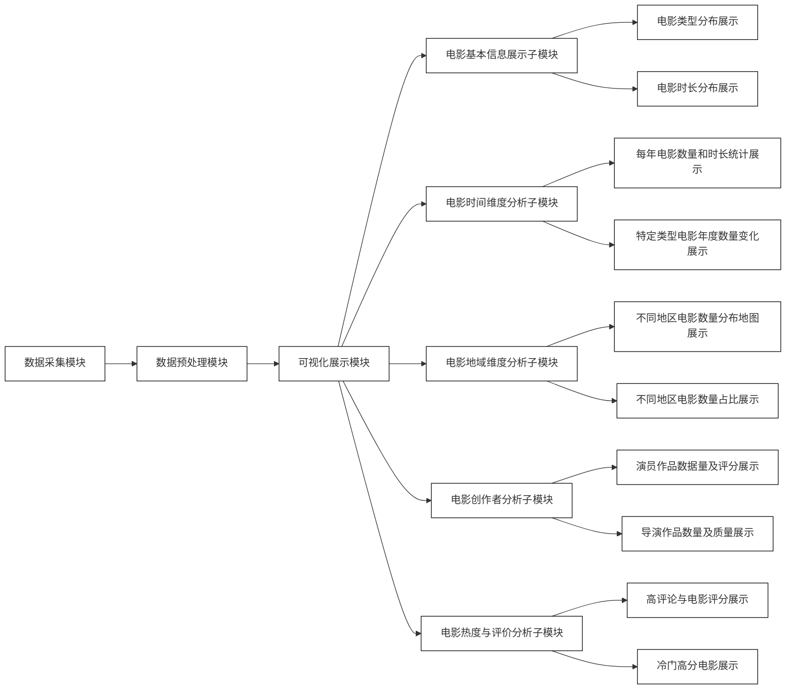

```mermaid
graph LR
A[数据采集模块] --> B[数据预处理模块]
B --> C[可视化展示模块]
C --> D1[电影基本信息展示子模块]
C --> D2[电影时间维度分析子模块]
C --> D3[电影地域维度分析子模块]
C --> D4[电影创作者分析子模块]
C --> D5[电影热度与评价分析子模块]
D1 --> E1[电影类型分布展示]
D1 --> E2[电影时长分布展示]
D2 --> E3[每年电影数量和时长统计展示]
D2 --> E4[特定类型电影年度数量变化展示]
D3 --> E5[不同地区电影数量分布地图展示]
D3 --> E6[不同地区电影数量占比展示]
D4 --> E7[演员作品数据量及评分展示]
D4 --> E8[导演作品数量及质量展示]
D5 --> E9[高评论与电影评分展示]
D5 --> E10[冷门高分电影展示]

classDef default fill:#FFFFFF,stroke:#000000,stroke-width:1px
class A,B,C,D1,D2,D3,D4,D5,E1,E2,E3,E4,E5,E6,E7,E8,E9,E10 default
```